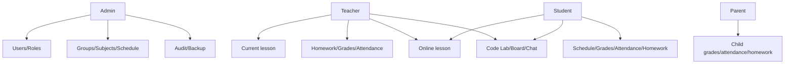
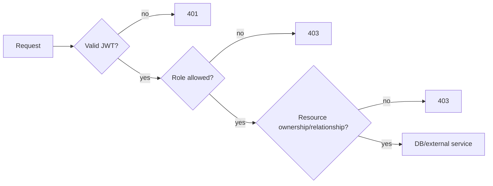
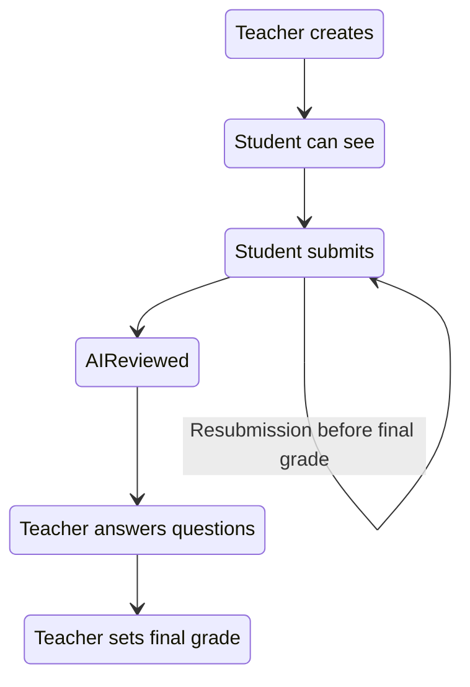
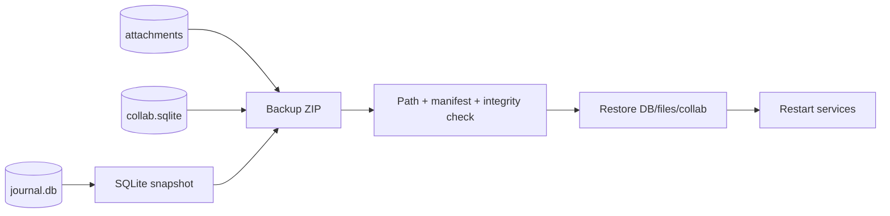

# Diagrams

## Roles

```mermaid
flowchart TD
    Admin[Admin] --> Users[Users/Roles]
    Admin --> Academic[Groups/Subjects/Schedule]
    Admin --> Audit[Audit/Backup]
    Teacher[Teacher] --> Lesson[Current lesson]
    Teacher --> HW[Homework/Grades/Attendance]
    Teacher --> Live[Online lesson]
    Teacher --> Lab[Code Lab/Board/Chat]
    Student[Student] --> StudentView[Schedule/Grades/Attendance/Homework]
    Student --> Live
    Student --> Lab
    Parent[Parent] --> ReadOnly[Child grades/attendance/homework]
```

## Authorization

```mermaid
flowchart LR
    Request --> JWT{Valid JWT?}
    JWT -- no --> 401[401]
    JWT -- yes --> Role{Role allowed?}
    Role -- no --> 403[403]
    Role -- yes --> Ownership{Resource ownership/relationship?}
    Ownership -- no --> 403b[403]
    Ownership -- yes --> Execute[DB/external service]
```

## Homework lifecycle

```mermaid
stateDiagram-v2
    Draft: Teacher creates
    Assigned: Student can see
    Submitted: Student submits
    TeacherReviewed: Teacher answers questions
    Final: Teacher sets final grade
    Draft --> Assigned
    Assigned --> Submitted
    Submitted --> AIReviewed
    AIReviewed --> TeacherReviewed
    TeacherReviewed --> Final
    Submitted --> Submitted: Resubmission before final grade
```

## Backup/restore

```mermaid
flowchart LR
    DB[(journal.db)] --> Snapshot[SQLite snapshot]
    Files[(attachments)] --> ZIP[Backup ZIP]
    Collab[(collab.sqlite)] --> ZIP
    Snapshot --> ZIP
    ZIP --> Validate[Path + manifest + integrity check]
    Validate --> Restore[Restore DB/files/collab]
    Restore --> Restart[Restart services]
```
